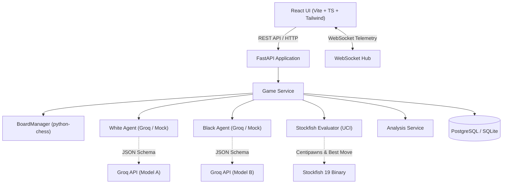

# ChessMind Arena — Architecture Overview

ChessMind Arena is a multi-agent AI chess laboratory architected for observing, recording, evaluating, and visualizing decision-making between opposing LLMs hosted on the Groq API.

## Core Tenets

1. **AI Decision vs Chess Truth vs Objective Evaluation**:
   - **AI Decision**: The candidate move and structured strategy summary proposed by the LLM.
   - **Chess Truth**: Validated strictly by `python-chess`. If the LLM proposes an illegal move, it is rejected and retried with backoff.
   - **Objective Evaluation**: Evaluated independently by Stockfish (depth 10–20). Stockfish acts as referee and impartial evaluator.

2. **No Private Chain-of-Thought Exposed**:
   - Agents return a concise `ChessDecision` JSON object explaining tactical/strategic factors directly intended for user inspection.

3. **Resilient Local Setup**:
   - Built-in automatic fallback engine evaluator and SQLite storage if PostgreSQL or Stockfish binary are not configured in a given environment.
